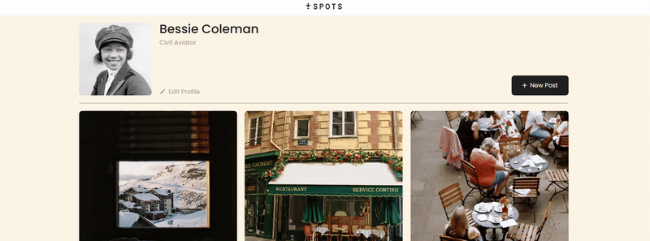
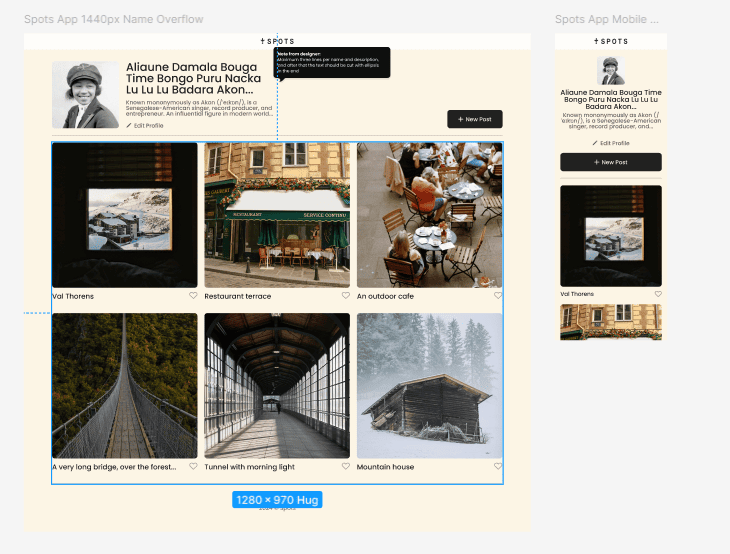

# Project 3: Spots interactive social media website

Live link: https://safak5330.github.io/se_project_spots/

This is the third project of the Software Engineering program at TripleTen. It was created using HTML and CSS, based off a layout provided in Figma. The purpose of this project was to demonstrate principles of flex box, grid, responsive hmtl/css site design, and media queries.

# Overview

- Intro
- Figma
- Features

**Intro**

This project demonstrates the layout for a social media website where users can upload their own avatar and post custom photos and captions. A 'like' button accompanies each post, allowing site users to interact. The layout for the website was designed for large monitors (1440px and greater), medium-sized laptops and tablets (between 630px and 960px), and mobile devices as small as 320px in width. In its full view, the site implements a grid in order to show two rows of three posts, and this shrinks down into a single column as the viewport shrinks.

**Figma**

The site was layed out according to full-size and small-size designs that were provided in Figma. This is a common way that designers share website layout guidelines to engineers and being able to adapt a Figma design to a live website allows for seamless cross-department cooperation. You can see the original layout design in the link below.

- [Link to the project on Figma](https://www.figma.com/file/BBNm2bC3lj8QQMHlnqRsga/Sprint-3-Project-%E2%80%94-Spots?type=design&node-id=2%3A60&mode=design&t=afgNFybdorZO6cQo-1)

## Project features

- Grid layout: used **display: grid;** in order to design a layout that was adaptable to screen size and not dependent on fixed widths. Using grid, you can set the number of columns and rows, and their size can be set with relative units which is very useful in responsive layouts.

### Project description video narrated by me

[Watch here!](https://drive.google.com/file/d/1EFi1A_W--7YnDYB6kLG9kftHhgzjyhoc/view?usp=drive_link)
